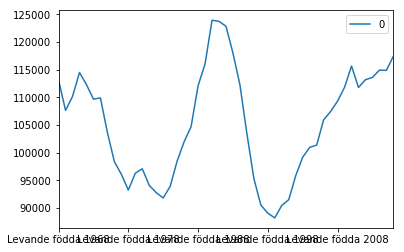

```python
import requests
import json
import pandas as pd

from io import StringIO
from IPython.core.display import HTML
```


```python
url = 'http://api.scb.se/OV0104/v1/doris/sv/ssd/BE/BE0101/BE0101H/FoddaK'
query = {"query": [], "response": {}}
```


```python
#CREATE NEW FILTER
code = 'Region'
kind = 'item'
values = ['00']
print(query)
new_filter = {"code": code, "selection": {"filter": kind, "values": values}}
try:
    ix = next(i for (i, d) in enumerate(query['query']) if d['code'] == code)
    query['query'][ix] = new_filter
except StopIteration:
    query["query"].append(new_filter)
```

    {'query': [], 'response': {}}
    


```python
query["response"] = {"format": 'csv'}
print(query)
r = requests.post(url, data=json.dumps(query))
```

    {'query': [{'code': 'Region', 'selection': {'filter': 'item', 'values': ['00']}}], 'response': {'format': 'csv'}}
    


```python
df = pd.read_csv(StringIO(r.text))
```





```python
df.T.head()
```


<div>
<table border="1" class="dataframe">
  <thead>
    <tr style="text-align: right;">
      <th></th>
      <th>0</th>
    </tr>
  </thead>
  <tbody>
    <tr>
      <th>region</th>
      <td>00 Riket</td>
    </tr>
    <tr>
      <th>Levande födda 1968</th>
      <td>113086</td>
    </tr>
    <tr>
      <th>Levande födda 1969</th>
      <td>107621</td>
    </tr>
    <tr>
      <th>Levande födda 1970</th>
      <td>110149</td>
    </tr>
    <tr>
      <th>Levande födda 1971</th>
      <td>114485</td>
    </tr>
  </tbody>
</table>
</div>


```python
query
```


    {'query': [{'code': 'Region',
       'selection': {'filter': 'item', 'values': ['00']}}],
     'response': {}}


```python
url = 'http://api.scb.se/OV0104/v1/doris/sv/ssd/HE/HE0110/HE0110A'
#url = 'http://api.scb.se/OV0104/v1/doris/sv/ssd/BE/BE0101/BE0101H/FoddaK'

#{"code":"Tid", "selection":{ "filter":"top", "values":["3"]}}],
query = {"query": [], "response": {'format': 'csv'}}
r = requests.post(url, data=json.dumps(query))
df = pd.read_csv(StringIO(r.text))
print(df)
```

    Empty DataFrame
    Columns: [[{"id":"SamForvInk1", type:"t", text:"Sammanräknad förvärvsinkomst för boende i Sverige hela året (antal personer,  medel- och medianinkomst samt totalsumma) efter region,  kön,  ålder och inkomstklass. År 1999 - 2014", updated:"2016-02-04T09:30:00"}, {"id":"SamForvInk1b", type:"t".1, text:"Sammanräknad förvärvsinkomst för boende i Sverige hela året (antal personer.1,  medel- och medianinkomst samt totalsumma) efter region.1,  kön och ålder i 1-årsklasser. År 1999 - 2014", updated:"2016-02-04T09:30:00"}.1, {"id":"SamForvInk2", type:"t".2, text:"Sammanräknad förvärvsinkomst för boende i Sverige den 31/12 resp år (antal personer,  medel- och medianinkomst samt totalsumma) efter region.2,  kön.1,  ålder och inkomstklass. År 1991 - 2014", updated:"2016-02-04T09:30:00"}.2, {"id":"InkAvTjanst", type:"t".3, text:"Inkomst av tjänst (antal personer,  medelvärden och totalsumma) efter region,  kön.2,  ålder och inkomstklass. År 2000 - 2014", updated:"2016-02-04T09:30:00"}.3, {"id":"SamForvInk1a", type:"t".4, text:"Sammanräknad förvärvsinkomst för boende i Sverige hela året (antal personer.2,  medel- och medianinkomst samt totalsumma) efter kön,  inkomstklass och ålder i 1-årsklasser. År 1999 - 2014", updated:"2016-02-04T09:30:00"}.4, {"id":"SamForvInk1c", type:"t".5, text:"Sammanräknad förvärvsinkomst för boende i Sverige hela året (antal personer.3,  medel- och medianinkomst samt totalsumma) efter region.3,  utbildningsnivå,  kön och ålder. År 2000 - 2014", updated:"2016-02-04T09:30:00"}]]
    Index: []
    
    [0 rows x 40 columns]
    


```python

```
