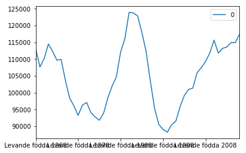

```python
import requests
import json
import pandas as pd
%matplotlib inline

from io import StringIO
from IPython.core.display import HTML
```


```python
url = 'http://api.scb.se/OV0104/v1/doris/sv/ssd/BE/BE0101/BE0101H/FoddaK'
query = {"query": [], "response": {}}
```


```python
#CREATE NEW FILTER
code = 'Region'
kind = 'item'
values = ['00']
print(query)
new_filter = {"code": code, "selection": {"filter": kind, "values": values}}
try:
    ix = next(i for (i, d) in enumerate(query['query']) if d['code'] == code)
    query['query'][ix] = new_filter
except StopIteration:
    query["query"].append(new_filter)
```


<div style='float: center'>
  </img>
</div>
